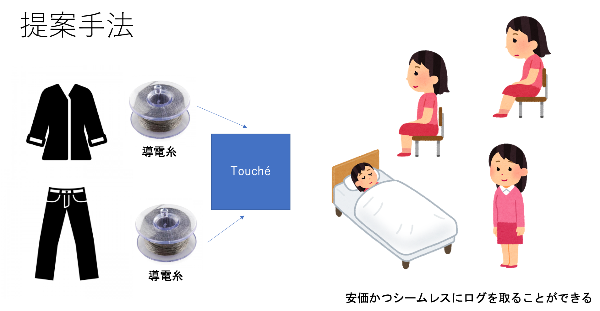

# 概要

衣服に導電糸を組み込み，接触をセンシングすることで着用している人間の3つの状態：立位，座位，仰臥位[^gyougai]を測定することができるシステムの実装を行なった．従来のモーションベースのログ収集方法よりもシームレスで違和感のないロギングを目指す．

[^gyougai]: 寝た状態のこと．

# 背景

生活ログは日常生活の様々な行動をデータとして残し，解析するためにしばしば計測される．Apple iOS13, 同社MacOSX CatalinaではScreen Timeが導入された．Screen Timeではデバイスごとのアプリケーション使用時間，持ち上げ回数，通知回数などのアクティビティを確認することができる．また，使用時間の傾向が先週，先月に比べてどうであるかも観測することができる．Screen Timeの情報には著者も驚かされることが多い．著者はある週で10時間近くTwitterをやっていることがわかった．

Apple Watchは人間が長時間座っていることを検知し，1時間に一回立ち上がることを勧める．このようにログを分析し，人間に働きかけることで生活習慣の改善につながると考えられる．

# 問題

日本は世界一座っている時間が長い[^nagai]ことで知られている．また，長時間座ったままでは体に悪影響を来たす．Apple Watch[^watch]はこれを防ぐために1時間座りっぱなしの場合，「スタンドの時間」を通知しユーザーに起立することを促す．

しかしながら，Apple Watchのようなモーションベースのアクティビティトラッカーは直接腕に身につける必要がある．常に身につける必要があり，違和感を感じ外してしまうとトラッキングすることができない．また，3万〜5万円程度と比較的高価である．

[^nagai]: 日本人は世界一「座りすぎ」？　糖尿病や認知症のリスク…仕事見直す企業も - 産経ニュース: https://www.sankei.com/life/news/190627/lif1906270023-n1.html
[^watch]: Apple Watch https://www.apple.com/jp/watch/

# アプローチ(Research Question)

[@fig:teian]衣服に導電糸[^ito]を縫い付け，Touche[^touche]を用いて接触をセンシングすることで人間の状態を検知する．衣服をセンサーとすることで人間の体に違和感なくロギングをすることができると考える．

{#fig:teian}

[^touche]: Touché: Enhancing Touch Interaction on Humans, Liquids, and Everyday Objects http://www.satomunehiko.com/ja/works/touche/
[^ito]: 導電糸10 m - スイッチサイエンス: https://www.switch-science.com/catalog/2537/

# 実装

ロギングをするためにはリアルタイムでセンシングを行う必要がある．Toucheのデモ[^demo]では4状態をProcessingを用いてセンシングし，ビジュアライズしている．ロギングのためにPCを常に持ち歩き，通信するのは不適である．

そこでProcessingのセンシングアルゴリズムをマイコンに移植し，オンボードでクラスタリングができるように実装した．Processingのアルゴリズムをそのまま使用するとマイコン[^arduino]のSRAMが足りないためfloatで扱う数字を2byteで管理するなどの最適化を行なった．また，Processingでは4状態のみのクラスタリングだったが32状態までクラスタリングできるように拡張した．これによって様々な姿勢を推定できるようになった．

EEPROMにデータを記録しているため，後ほどデータを吸い出すことが可能である．

{#fig:zissou}

導電糸を縫い付けた衣服をに[@fig:ifuku]示す．

{#fig:ifuku}

[^demo]: https://github.com/Illutron/AdvancedTouchSensing
[^arduino]: ATmega328P: http://ww1.microchip.com/downloads/en/DeviceDoc/Atmel-7810-Automotive-Microcontrollers-ATmega328P_Datasheet.pdf

# 評価方法

Toucheを用いた姿勢センシングでも従来のモーションベースのロギング方法と同等の精度が出るか検証する．また，モーションベースのロギング方法と比較して違和感なくロギングできるかを検証する．

## 実験における独立変数

* Toucheを用いたセンシングデバイスで記録する
* Apple Watchで記録する
* 手動で記録する．

## 実験における従属変数

* 手動で記録したログデータに対するApple Watch，Toucheデバイスのログ精度．
* 身につけて生活しさいの違和感のなさ

## 実験手順（スキット）

被験者にはセンサが縫い付けられた衣服を着て生活してもらう．ユーザーは特に特別は操作をする必要はなく，身につけて生活しているだけで自動的にロギングされる．デバイスを外せば衣服は洗濯してもらっても問題ない．また，Apple Watchを同時に身につけてもらうものとする．

### 同意書

生活における立位，座位，仰臥位をログとして記録させていただく旨を伝える．実験にデータを使う了承をとる．同意はいつでも撤回することができる．

### 実験のデモ

* 使い方の説明をする．
* まずは著者が使って様子を見せる．
* 実際にログが取れていることを見せる．

### 実験の説明

* 実際に身につけてもらう．
* 実際にログが取れていることを確認する．

### アンケート

アンケートにはリッカートスケールを用いる．

* 実験前アンケート
  * 普段ロガーを身につけて生活しているか？
  * Apple Watchなどのアクティビティトラッカーを身につけることに違和感があるか？
* 実験後アンケート
  * Apple Watchなどのアクティビティトラッカーを身につけることに違和感があるか？
  * Toucheデバイスを使ったロギングに生活に違和感はあるか？

# 結果

スタンドアロンでロギングをすることができた．導電糸を縫い付けた衣服を着て，立位，座位，仰臥位をとったところ実際にクラスタリングをすることができた．ロギングも正常に動作し，このまま実験を行えばToucheを用いたロギングデバイスを評価できると考える．

今回はプロトタイプのため，ブレッドボードでの実装だったため基板に起こして実際に身につけられるような形にしたい．また，今回は導電糸の位置が1箇所のみだった．このため，この場所のセンサーが椅子に触れない，反応しないと正常にクラスタリングがされないことがあった．ズボン，上着など様々な位置に導電糸を縫い付け2次元ではなく3次元でセンシングすることで複数のセンサー状態を考慮したクラスタリングを行うことができると考える．

{#fig:hannou}